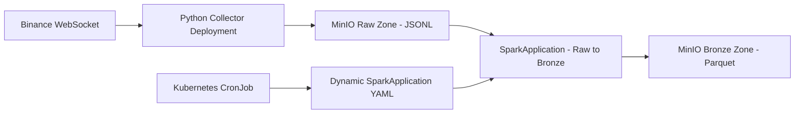

# Local Spark + MinIO Lakehouse on Kubernetes

This project is a local, Kubernetes-native lakehouse pipeline built for learning and experimenting with Spark, MinIO, and cloud-native batch processing patterns.

The goal is not only to run Spark locally, but to understand how a production-like data platform can be designed with separate ingestion, storage, scheduling, and processing layers.

## Architecture



## Current Pipeline

The current pipeline ingests Binance BTCUSDT 1-minute kline data and stores it in a local MinIO-backed lakehouse.

### Data Flow

1. A Python collector connects to Binance WebSocket.
2. Incoming messages are written to MinIO as raw JSONL files.
3. A Kubernetes CronJob runs every hour.
4. The CronJob dynamically creates a SparkApplication.
5. Spark reads the previous hour's raw JSONL data.
6. Spark transforms the data into typed Bronze Parquet format.
7. Bronze data is written back to MinIO partitioned by symbol, date, and hour.

## Lakehouse Zones

MinIO bucket:

```text
datalake
```

Main prefixes:

```text
raw/
bronze/
silver/
gold/
checkpoints/
audit/
metadata/
```

Current raw path:

```text
raw/market/binance/klines_1m/symbol=BTCUSDT/date=YYYY-MM-DD/hour=HH/
```

Current bronze path:

```text
bronze/market/binance/klines_1m/symbol=BTCUSDT/date=YYYY-MM-DD/hour=HH/
```

## Kubernetes Namespaces

```text
lakehouse       -> MinIO
ingestion       -> Binance collector
spark-operator  -> Spark Operator
spark-jobs      -> SparkApplication, Spark driver/executor pods, scheduler CronJob
```

## Main Components

### MinIO

MinIO is used as the local object storage layer.

It acts as an S3-compatible storage backend for Spark and the collector.

### Binance Collector

The collector is a Python application running as a Kubernetes Deployment.

It connects to Binance WebSocket and writes raw market events to MinIO as JSONL files.

The collector intentionally writes source-close raw data. It does not deduplicate, aggregate, or normalize the payload at this stage.

### Spark Operator

Spark Operator manages SparkApplication custom resources on Kubernetes.

Instead of manually running `spark-submit`, Spark jobs are submitted declaratively as Kubernetes resources.

### Raw to Bronze Spark Job

The raw-to-bronze job reads raw JSONL files from MinIO and writes typed Parquet files to the Bronze layer.

The job performs:

- timestamp conversion
- decimal casting for price and volume fields
- long casting for trade and event identifiers
- boolean casting for candle close status
- partitioned Parquet output

Bronze intentionally keeps both open and closed kline updates. Deduplication and final candle selection belong to the Silver layer.

### CronJob Scheduler

The hourly scheduler is implemented as a Kubernetes CronJob.

Instead of using one static SparkApplication YAML, the CronJob dynamically generates a new SparkApplication for each hourly run.

Example generated SparkApplication names:

```text
raw-to-bronze-klines-2026070813
raw-to-bronze-klines-2026070814
raw-to-bronze-klines-2026070815
```

This keeps each Spark run isolated and easier to inspect.

## Why Dynamic SparkApplication?

A static SparkApplication is useful for manual testing, but it is not ideal for recurring batch jobs.

This project uses a dynamic SparkApplication pattern because:

- each run gets a unique name
- driver pod names become unique
- hourly run history is easier to inspect
- manual delete/apply loops are avoided
- the processing window is calculated automatically

The CronJob calculates:

```text
START_DATE / START_HOUR = previous UTC hour
END_DATE / END_HOUR     = current UTC hour
```

The Spark job processes data using an end-exclusive interval:

```text
[START, END)
```

For example, if the CronJob runs at `14:05 UTC`, it processes:

```text
13:00 <= data < 14:00
```

## Important Spark Settings

The SparkApplication uses the following important Spark configurations:

```yaml
spark.sql.caseSensitive: "true"
spark.sql.sources.partitionOverwriteMode: dynamic
spark.hadoop.fs.s3a.endpoint: http://minio.lakehouse.svc.cluster.local:9000
spark.hadoop.fs.s3a.path.style.access: "true"
spark.hadoop.fs.s3a.impl: org.apache.hadoop.fs.s3a.S3AFileSystem
spark.hadoop.fs.s3a.connection.ssl.enabled: "false"
spark.hadoop.fs.s3a.aws.credentials.provider: com.amazonaws.auth.EnvironmentVariableCredentialsProvider
spark.jars.packages: org.apache.hadoop:hadoop-aws:3.3.4
spark.jars.ivy: /tmp/.ivy2
```

### caseSensitive

Binance JSON contains fields such as `e` and `E`, `t` and `T`, `l` and `L`.

Spark is case-insensitive by default, so case sensitivity is required.

### dynamic partition overwrite

The Bronze job writes to a partitioned base path.

Dynamic partition overwrite ensures that only the partitions included in the current DataFrame are overwritten.

This prevents one hourly job from deleting the full Bronze table.

## Build Images

Build the Binance collector image:

```bash
docker build -t binance-collector:1.0.0 -f apps/binance-collector/Dockerfile apps/binance-collector
```

Build the raw-to-bronze Spark image:

```bash
docker build -t raw-to-bronze-klines:1.0.0 -f spark/jobs/raw_to_bronze_klines/Dockerfile spark/jobs/raw_to_bronze_klines
```

## Deploy Core Components

Apply namespaces:

```bash
kubectl apply -f k8s/namespaces/
```

Deploy MinIO:

```bash
kubectl apply -f k8s/minio/
```

Deploy Spark Operator resources:

```bash
kubectl apply -f k8s/spark-operator/
```

Deploy the Binance collector:

```bash
kubectl apply -f k8s/ingestion/
```

Deploy the hourly raw-to-bronze scheduler:

```bash
kubectl apply -f k8s/schedules/raw-to-bronze-klines-cronjob.yaml
```

## Trigger CronJob Manually

To test the CronJob without waiting for the next scheduled run:

```bash
kubectl create job \
  --from=cronjob/raw-to-bronze-klines-cronjob \
  raw-to-bronze-klines-manual-001 \
  -n spark-jobs
```

## Useful Commands

Check MinIO pods:

```bash
kubectl get pods -n lakehouse
```

Check collector logs:

```bash
kubectl logs -f deployment/binance-collector -n ingestion
```

Check CronJobs:

```bash
kubectl get cronjobs -n spark-jobs
```

Check scheduler jobs:

```bash
kubectl get jobs -n spark-jobs
```

Check SparkApplications:

```bash
kubectl get sparkapplications -n spark-jobs
```

Check Spark driver and executor pods:

```bash
kubectl get pods -n spark-jobs
```

Follow Spark driver logs:

```bash
kubectl logs -f <spark-driver-pod-name> -n spark-jobs
```

Open MinIO Console:

```bash
kubectl port-forward svc/minio -n lakehouse 9001:9001
```

Then open:

```text
http://localhost:9001
```

## Current Status

Completed:

- Kubernetes namespaces
- MinIO StatefulSet and bucket structure
- Binance WebSocket collector
- Raw JSONL ingestion
- Spark Operator setup
- Raw to Bronze PySpark job
- Dynamic hourly SparkApplication submission with Kubernetes CronJob
- Bronze Parquet output partitioned by symbol, date, and hour

Next possible steps:

- Silver layer with closed-candle filtering
- deduplication by symbol, interval, and kline start time
- gap detection
- REST-based backfill for missing candles
- Gold layer aggregations
- data quality checks
- table format migration with Iceberg, Delta, or Hudi
